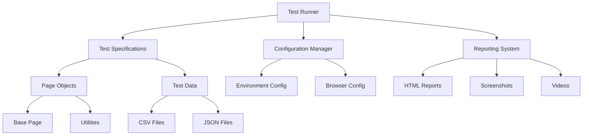

# Playwright Testing Framework Design Document

## Overview

The Playwright Testing Framework is designed as a comprehensive, enterprise-grade automation solution for testing the ORDISS web application. The framework follows industry best practices including the Page Object Model pattern, data-driven testing, and modular architecture to ensure maintainability, scalability, and ease of use.

## Architecture

### High-Level Architecture



### Framework Layers

1. **Test Layer**: Contains test specifications and test runners
2. **Page Object Layer**: Implements Page Object Model with reusable page classes
3. **Data Layer**: Manages test data from CSV files and JSON configurations
4. **Utility Layer**: Provides common functions and helpers
5. **Configuration Layer**: Handles environment and execution settings
6. **Reporting Layer**: Generates reports, captures screenshots and videos

## Components and Interfaces

### 1. Base Page Class

**Purpose**: Provides common functionality that all page objects inherit from.

**Key Features**:
- Navigation methods (goto, waitForLoad)
- Element interaction methods (click, type, select)
- Waiting strategies (waitForElement, waitForText)
- Screenshot capture
- Logging integration

**Interface**:
```javascript
class BasePage {
  constructor(page)
  async goto(url)
  async waitForLoad()
  async clickElement(selector)
  async typeText(selector, text)
  async selectOption(selector, value)
  async waitForElement(selector)
  async takeScreenshot(name)
  async logAction(action, details)
}
```

### 2. Page Object Classes

**Purpose**: Encapsulate page-specific elements and actions using the Page Object Model pattern.

**Login Page**:
- Handles authentication functionality
- Manages login form interactions
- Validates login success/failure states

**Unit Types Page**:
- Manages CRUD operations for unit types
- Handles form submissions and validations
- Implements search and filter functionality

### 3. Test Data Management

**CSV Data Driver**:
- Reads test data from CSV files
- Validates data format and integrity
- Provides data iteration for parameterized tests

**JSON Configuration**:
- Stores user credentials securely
- Manages environment-specific settings
- Handles test configuration parameters

### 4. Test Runner System

**Core Test Runner**:
- Orchestrates test execution
- Manages browser lifecycle
- Handles parallel execution
- Coordinates reporting

**Test Suites**:
- Smoke tests for critical functionality
- Regression tests for comprehensive coverage
- Module-specific tests for targeted testing

### 5. Utilities and Helpers

**Common Utilities**:
- String manipulation functions
- Date/time utilities
- Random data generation
- File operations
- Validation helpers

**Test Helpers**:
- Setup and teardown functions
- Authentication helpers
- Data preparation utilities
- Assertion helpers

## Data Models

### Test Data Structure

**User Data Model**:
```javascript
{
  username: string,
  password: string,
  role: string,
  expectedRedirect: string
}
```

**Unit Type Data Model**:
```javascript
{
  name: string,
  shortName: string,
  category: string,
  service: string,
  type: string,
  serviceType: string,
  corps: string
}
```

**Test Configuration Model**:
```javascript
{
  baseURL: string,
  timeout: number,
  retries: number,
  browsers: array,
  headless: boolean,
  screenshot: string,
  video: string
}
```

### File Structure

```
playwright-framework/
├── package.json                    # Dependencies and scripts
├── playwright.config.js            # Playwright configuration
├── pages/                          # Page Object Models
│   ├── BasePage.js                 # Base page class
│   ├── LoginPage.js                # Login page object
│   └── UnitTypesPage.js            # Unit types page object
├── tests/                          # Test specifications
│   ├── auth.setup.js               # Authentication setup
│   ├── global-setup.js             # Global test setup
│   ├── global-teardown.js          # Global test cleanup
│   ├── login.spec.js               # Login test cases
│   └── unit-types.spec.js          # Unit types test cases
├── test-data/                      # Test data files
│   ├── users.csv                   # User test data
│   └── unit-types.csv              # Unit types test data
├── utils/                          # Utility functions
│   ├── utils.js                    # Common utilities
│   └── userData.json               # User configuration
├── config/                         # Configuration files
│   └── test-config.js              # Test configuration
├── scripts/                        # Execution scripts
│   └── run-tests.js                # Advanced test runner
└── .github/workflows/              # CI/CD configuration
    └── playwright-tests.yml        # GitHub Actions workflow
```

## Error Handling

### Error Handling Strategy

1. **Graceful Degradation**: Tests continue execution when non-critical errors occur
2. **Detailed Logging**: All errors are logged with context and timestamps
3. **Screenshot Capture**: Automatic screenshots on test failures
4. **Retry Mechanism**: Configurable retry logic for flaky tests
5. **Error Categorization**: Different handling for different error types

### Error Types and Responses

- **Element Not Found**: Retry with exponential backoff, then fail with screenshot
- **Network Timeout**: Retry up to configured limit, log network conditions
- **Authentication Failure**: Immediate failure with detailed error message
- **Data Validation Error**: Log validation details and continue with next test case
- **Browser Crash**: Restart browser instance and retry test

## Testing Strategy

### Test Execution Modes

1. **Smoke Tests**: Quick validation of critical functionality
2. **Regression Tests**: Comprehensive testing of all features
3. **Module Tests**: Focused testing of specific application modules
4. **Cross-Browser Tests**: Validation across different browsers
5. **Performance Tests**: Response time and load testing

### Test Data Strategy

1. **Static Data**: Predefined test data in CSV files for consistent testing
2. **Dynamic Data**: Generated test data using Faker.js for variety
3. **Environment Data**: Environment-specific configurations and credentials
4. **Cleanup Data**: Automated cleanup of test data after execution

### Parallel Execution Strategy

- **Worker Isolation**: Each test worker runs in isolated browser context
- **Data Partitioning**: Test data is partitioned to avoid conflicts
- **Resource Management**: Controlled resource allocation for optimal performance
- **Synchronization**: Coordination mechanisms for dependent tests

## CI/CD Integration

### GitHub Actions Workflow

**Trigger Events**:
- Pull request creation/updates
- Push to main branch
- Scheduled daily runs
- Manual workflow dispatch

**Execution Steps**:
1. Environment setup (Node.js, dependencies)
2. Browser installation
3. Test execution with multiple configurations
4. Report generation and artifact collection
5. Notification of results

**Artifact Management**:
- HTML test reports
- Screenshots and videos
- Test logs and traces
- Performance metrics

### Docker Integration

**Container Strategy**:
- Lightweight base image with Node.js and browsers
- Multi-stage build for optimized image size
- Environment variable configuration
- Volume mounting for test results

**Orchestration**:
- Docker Compose for local development
- Kubernetes deployment for scaled execution
- Container registry integration
- Automated image updates

## Performance Considerations

### Optimization Strategies

1. **Parallel Execution**: Configurable worker threads for faster test runs
2. **Browser Reuse**: Efficient browser context management
3. **Element Caching**: Intelligent element selector caching
4. **Network Optimization**: Request interception and response caching
5. **Resource Management**: Memory and CPU usage monitoring

### Scalability Features

- **Horizontal Scaling**: Support for distributed test execution
- **Load Balancing**: Intelligent test distribution across workers
- **Resource Monitoring**: Real-time performance metrics
- **Auto-scaling**: Dynamic resource allocation based on load

## Security Considerations

### Credential Management

- **Environment Variables**: Secure storage of sensitive credentials
- **Encryption**: Encrypted storage of test data
- **Access Control**: Role-based access to test configurations
- **Audit Logging**: Comprehensive logging of security-related actions

### Test Isolation

- **Browser Isolation**: Each test runs in isolated browser context
- **Data Isolation**: Test data partitioning to prevent interference
- **Network Isolation**: Controlled network access during testing
- **Cleanup Procedures**: Automatic cleanup of sensitive test data